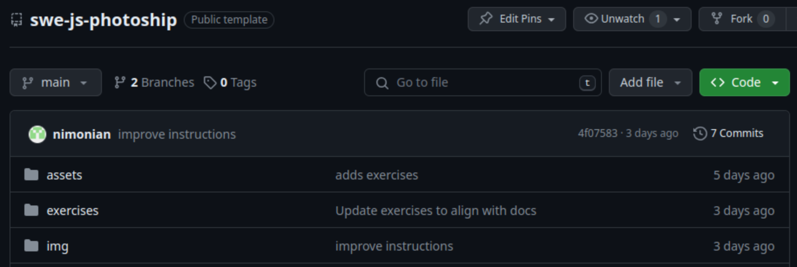
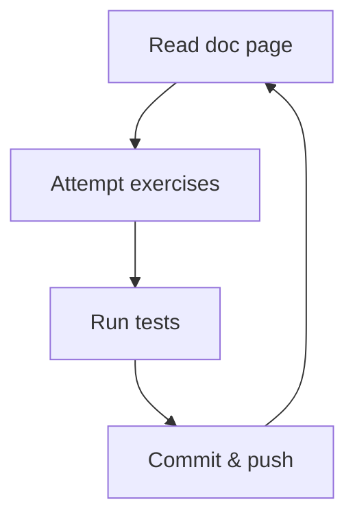

<p align="center">
  
</p>

# Photoship

This project is all about manipulating images.

**Photoship** is a revolutionary image processing tool which allows anyone to
edit images in the most astounding ways!

- Flip the image? No problem!
- Make it black and white? Easy!
- Use AI to give everyone facial tattoos? Planned for a future release!

## Getting started

1. Make sure you have [node, npm](https://swe-docs.netlify.app/js/installation.html) and git installed on your machine.

1. Clone the repository (i.e. download it), so you have a copy on your machine.
   Open a terminal where you'd like the project's folder to be downloaded to,
   and run

   ```bash
   git clone <your-repository-url>
   ```

   You should be able to copy and paste your repository url from the repo home
   page github.com. You can also get it by clicking on the green button to the
   top right that says `< > Code`.

   

1. Once cloned, open a terminal in the project root folder, and run

   ```bash
   npm install
   ```

   to get the dependencies.

   You should see some output in the terminal saying the packages have been
   audited. If you've got this far, great! You're on track.

   If you see a message about "vulnerabilities", don't worry. We aren't
   deploying our code. This is something we'll talk about later.

1. Get started with the deep dive below and happy learning!

## Deep dive



Before working on the Photoship project, there are a few things we need to
learn. There are some documentation pages which will teach you what you need to
know, and some exercises for you to practice your skills.

### Working with arrays

1. Read the docs on
   [working with arrays](https://swe-docs.netlify.app/js/working-with-arrays.html).

1. Complete Exercise 1a:

   - You'll find it in `exercises/1a.js`.

   - Run `npm run test:1a` in the terminal to see if you got it right!

   - Once you pass the tests, type `git commit -am "Solves 1a"` in the terminal
     and hit enter to commit your solution.

   - Now type `git push` to sync your changes to github.

1. Do the same for Exercise 1b.

### Array methods

1. Read the docs on
   [array methods](https://swe-docs.netlify.app/js/array-methods.html).

1. Solve, commit and push Exercise 2a.

1. Solve, commit and push Exercise 2b.

### Working with strings

1. Read the docs on
   [string methods](https://swe-docs.netlify.app/js/string-methods.html).

1. Solve, commit and push Exercise 3a.

1. Solve, commit and push Exercise 3b.

## Workshop

Once the deep dive is complete, you're ready to get started working on
Photoship!

Find the `CONTRIBUTING.md` file for your next instructions.
